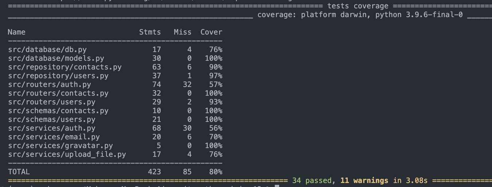

### Docker Compose:

```bash
docker compose up
```

### FastAPI:

```bash
fastapi dev
```

### Redis:

```bash
redis-cli
```

```bash
monitor
```

### Docs

```bash
cd docs && make html && open _build/html/index.html
```

### Tests

```bash
pytest --cov=src tests/
```


